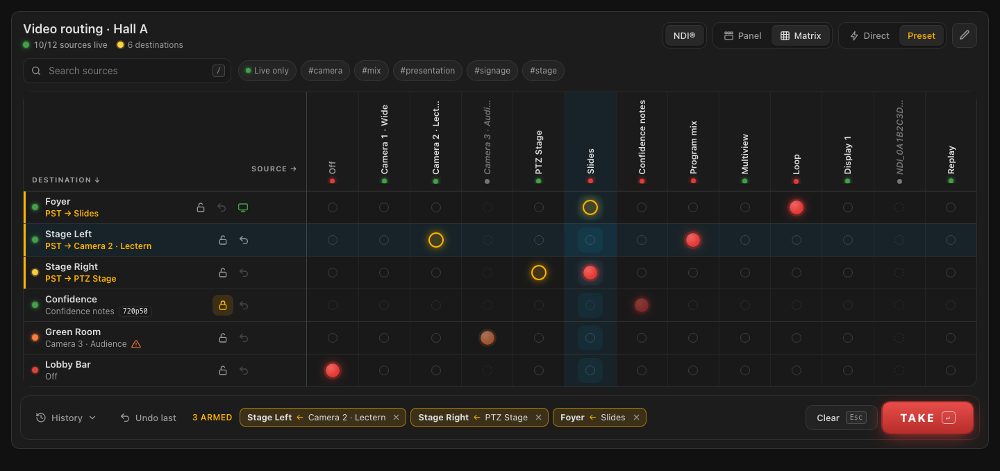
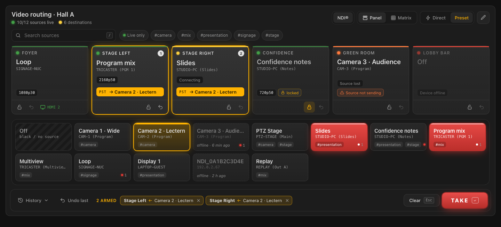
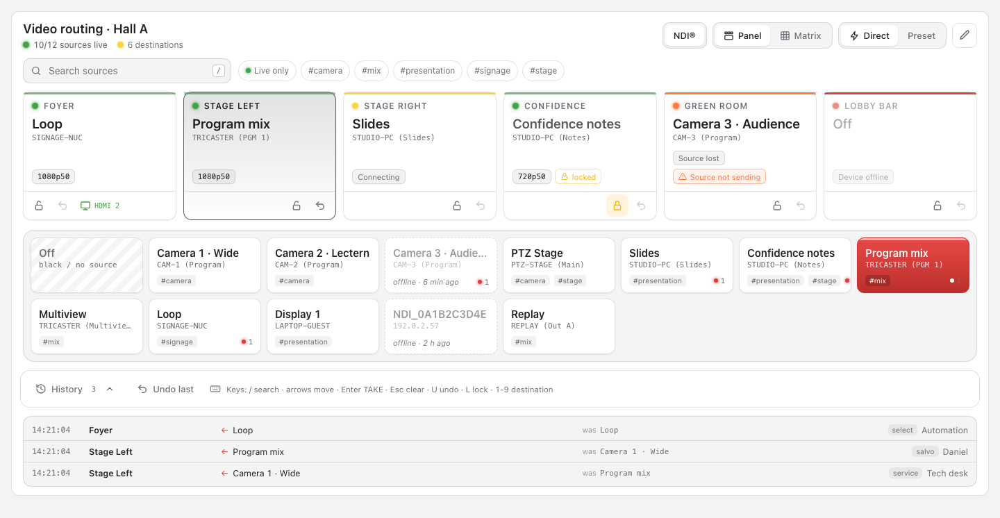
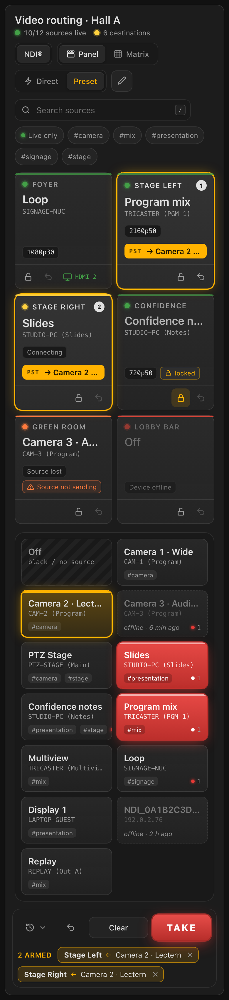

# AV Matrix for Home Assistant

**Smart crosspoint router for NDI® decoders – BirdDog, Magewell – extensible for Dante and more.**

[](https://hacs.xyz/docs/faq/custom_repositories)
[](https://github.com/strelle/ha-av-matrix/actions/workflows/validate.yml)


Turn the NDI® decoders behind your screens into a video router you control from Home Assistant: a source selector
per screen, automatic discovery of every NDI source on the network, a matrix card for the dashboard, automations,
HomeKit, and optional TV power/input control.

> Deutsch: [siehe unten](#deutsch).



<table><tr>
<td width="68%"><br>
</td>
<td width="32%"></td>
</tr></table>

*Screenshots from the [mock demo](docs/demo/index.html) (no Home Assistant needed: serve the repo with
`python3 -m http.server` and open `/docs/demo/`).*

## Features

- **Destinations** = your decoders (one config entry per device, as many as you like). Multi-channel devices get one
  destination per channel.
- **Sources** are discovered automatically and shared by all decoders:
  - mDNS (`_ndi._tcp.local.`) through Home Assistant's zeroconf,
  - the source lists of all configured decoders,
  - deduplicated by NDI name, stale entries filtered (TCP check), 2-minute hysteresis so lists don't jump,
  - BirdDog's `NDI_<id>` placeholders for names with umlauts are mapped to the real name.
- **Entities per destination:** `select` *Source* (the crosspoint), `sensor` *Connection*
  (connected / connecting / no source / source not sending / offline), `sensor` *Resolution* (e.g. `1920x1080p50`),
  `binary_sensor` *Connected*, `switch` *Route lock*; per device a *Refresh sources* `button`.
- **Actions:** `av_matrix.route`, `av_matrix.salvo` (several routes at once, validated first),
  `av_matrix.lock` / `unlock`, `av_matrix.undo`, `av_matrix.refresh_sources`; event `av_matrix_routed`.
- **Linked displays:** power on a TV/projector and switch its input when a destination is routed.
- **Labels:** give cryptic NDI names a friendly label and tags (via the WebSocket API / card).
- **Router panel card** `custom:av-matrix-card`, shipped with the integration — no manual resource needed:
  X-Y panel and matrix view, direct or preset + TAKE (salvo), lock, undo, labels, history, keyboard control.
- **HomeKit-ready:** the source selects work with the HomeKit Bridge (one switch per source).
- Config flow with connection test, re-authentication, reconfigure, options, diagnostics (passwords redacted).
- Protocol-independent core: NDI® today, Dante on the roadmap.

## Supported devices

| Device | Protocol | Status | Tested firmware | Notes |
|---|---|---|---|---|
| Magewell Pro Convert NDI to AIO | NDI® | ✅ verified (login, sources, routing, status) | 1.3.24 | other Pro Convert NDI decoders (to HDMI / SDI / 12G) use the same API — *untested* |
| BirdDog PLAY | NDI® | ⚠️ *untested with this integration* | (1.0.14 in an earlier project) | API on port 8080 |
| BirdDog Mini / Flex / Studio NDI / multi-channel | NDI® | ⚠️ *untested* | – | multi-channel via `ChNum` is *untested* |

Details and API notes: [docs/devices.md](docs/devices.md). Want another device? Open a
[device request](https://github.com/strelle/ha-av-matrix/issues/new?template=device_request.yml) or
[write a driver](CONTRIBUTING.md).

## Installation

### HACS (recommended)

1. HACS → ⋮ → *Custom repositories* → add `https://github.com/strelle/ha-av-matrix`, type *Integration*.
2. Search for **AV Matrix**, download, restart Home Assistant.
3. *Settings → Devices & services → Add integration → AV Matrix.*

### Manual

Copy `custom_components/av_matrix` (or unzip `av_matrix.zip` from the
[latest release](https://github.com/strelle/ha-av-matrix/releases/latest)) into `<config>/custom_components/av_matrix`
and restart Home Assistant.

Requires Home Assistant **2026.8** or newer.

## Configuration

Add one entry per device:

1. Choose the protocol and device type, e.g. *NDI® · Magewell Pro Convert*.
2. Enter host/IP, port (empty = default), credentials and an optional name. The connection is tested before the
   device is added.
   - **Magewell:** factory login is `Admin` / `Admin` — please change the password in the device's web UI.
   - **BirdDog:** the API on port 8080 normally needs no password; it is only used if the device asks for a login.
     Set *Number of decoder channels* for multi-channel devices.
3. Options (⚙ on the entry): polling interval (default 5 s) and a **linked display** per destination.

Sources need no configuration: everything that sends NDI on the network shows up within seconds.

## Dashboard card

The card is loaded automatically. Add it via *Add card → AV Matrix* (visual editor) or YAML. In a sections
view give it the full width.

```yaml
type: custom:av-matrix-card
title: Video routing
mode: panel            # panel (X-Y) | matrix
take_mode: preset      # direct | preset (arm + TAKE)
# protocol: ndi        # start tab
# show_offline: true
# compact: false
# columns: 6           # source columns in the panel, 0 = auto
# destinations:        # selection and order, default: all
#   - select.stage_left_source
#   - select.stage_right_source
```

| Option | Default | Description |
|---|---|---|
| `title` | `AV Matrix` | Card title (empty = none). |
| `mode` | `panel` | `panel`: destinations on top, sources below (X-Y panel). `matrix`: destinations × sources grid. Narrow cards (< 640 px) start in panel mode. |
| `take_mode` | `direct` | `direct`: tapping a source switches immediately. `preset`: tapping arms the route (amber), **TAKE** switches all armed routes at once (salvo). |
| `protocol` | first | Protocol tab to start on (`ndi`, later `dante`). Only sources of the same protocol can be routed. |
| `show_offline` | `true` | Show sources that stopped sending (greyed, "offline · 6 min"). |
| `compact` | `false` | Smaller tiles. |
| `columns` | auto | Number of source columns in panel mode. |
| `destinations` | all | List of destination `select` entities: which ones to show, in this order. |

Mode and take mode can also be switched in the card header at any time.

**Operating it like a router panel**

- **Panel:** pick a destination (its current source lights up red = program/tally), then pick a source.
  Several destinations: **Shift/Ctrl-click** or **long-press** (touch) – the source then goes to all of them
  (salvo). Number badges show the selection order.
- **Matrix:** click a crosspoint. Filled red = on air, amber ring = armed, orange = routed source not sending.
  Hover shows a crosshair; headers stay in place while scrolling large matrices.
- **Preset + TAKE:** armed routes are listed in the take bar; **TAKE** switches them together (validated first –
  a locked destination fails the whole salvo), **Clear**/Esc discards them. If switching fails the presets come back
  and an error is shown.
- **Status:** LED and top line per destination – green connected, yellow (pulsing) connecting, grey no source,
  orange source not sending, red device offline; resolution chip (e.g. `1080p50`).
- **Lock** (padlock) protects a destination, **undo** (↶) restores its previous source; *Undo last* in the footer
  undoes the latest route made from the card. The **TV** button switches a linked display on/off and shows its input.
- **Search and tags** filter the sources; *Live only* hides offline sources.
- **Labels (admins):** pencil button in the header, then tap a source – or right-click / long-press a source.
  Give cryptic NDI names a friendly label and tags; the NDI name stays visible in small print.
- **History:** the last 50 routes with time, destination, source, previous source, origin and user (who switched;
  user names are resolved for admins).
- Switching shows *switching…* immediately and is confirmed by the live state from Home Assistant.

**Keyboard** (when the card has focus):

| Key | Action |
|---|---|
| `/` | Search sources (Esc clears, ↓ jumps into the sources) |
| Arrow keys | Move between destinations, sources and crosspoints |
| Enter / Space | Press the focused tile; **Enter** elsewhere (or Ctrl/⌘+Enter anywhere) = **TAKE** |
| Esc | Clear presets / multi-selection |
| `U` | Undo (focused or selected destination, else the last route) |
| `L` | Lock / unlock the focused or selected destination |
| `1` – `9` | Select destination 1–9 (Shift adds to the selection) |

The card follows your Home Assistant theme (dark and light) and respects *reduced motion*. Tally colours can be
themed with `--av-matrix-tally-color` and `--av-matrix-preset-color`. Without the WebSocket API (older version)
it falls back to the `select` entities (*basic mode*). The plain `select` entities work in any entities card too.

## Automations

Route on a button press, and the screens of a room at once:

```yaml
automation:
  - alias: "Show slides in the lobby"
    triggers:
      - trigger: state
        entity_id: input_button.lobby_slides
    actions:
      - action: av_matrix.route
        target:
          entity_id: select.lobby_source
        data:
          source: "STUDIO-PC (Slides)"

  - alias: "Conference start"
    triggers:
      - trigger: time
        at: "08:45:00"
    actions:
      - action: av_matrix.salvo
        data:
          routes:
            - destination: select.lobby_source
              source: "STUDIO-PC (Welcome)"
            - destination: select.stage_left_source
              source: "CAMERA-1 (Program)"
            - destination: select.stage_right_source
              source: "None"   # off

  - alias: "Notify when a screen loses its source"
    triggers:
      - trigger: state
        entity_id: sensor.lobby_connection
        to: source_lost
        for: "00:00:30"
    actions:
      - action: notify.notify
        data:
          message: "Lobby screen: source stopped sending"
```

React to routing with the event `av_matrix_routed` (`entity_id`, `source`, `previous_source`, `origin`).
Lock a screen during a show with `av_matrix.lock` or its *Route lock* switch.

## Linked displays

*E.g. LG webOS TVs via the webOS integration — works with any `media_player`.*

In the options of a device, pick a `media_player` per destination, its input (e.g. `HDMI 2`, suggestions come from
the TV's source list) and whether to

- **power on & switch input on route** (default on), and
- **turn the display off when routed to None**.

When the destination is routed, AV Matrix turns the display on if needed, waits until it is on (max 10 s, without
blocking other destinations) and selects the input if it is not already active. Display problems never fail the
route; they are logged and shown as `display_error`.

## HomeKit

Expose the `select.*_source` entities with the **HomeKit Bridge** integration. HomeKit Bridge shows a `select`
as a group of switches, one per option — tap a switch to route that source. Tips:

- HomeKit builds the accessory when the bridge starts; sources that appear later need a reload of the HomeKit
  Bridge entry. For a stable HomeKit view, create a template `select` with your favourite sources and route via
  `av_matrix.route`.
- Give long NDI names a label so the switches stay readable.

## Updates

Every change to the integration is published as a GitHub release, so HACS shows it as an **update entity**
(`update.av_matrix_update`) with release notes. Integration updates need a **Home Assistant restart** to become active.

Optional auto-update, only when you allow it (an `input_boolean.av_matrix_auto_update`), with a nightly restart:

```yaml
automation:
  - alias: "AV Matrix auto-update"
    triggers:
      - trigger: state
        entity_id: update.av_matrix_update
        to: "on"
    conditions:
      - condition: state
        entity_id: input_boolean.av_matrix_auto_update
        state: "on"
    actions:
      - action: update.install
        target:
          entity_id: update.av_matrix_update
      - action: input_boolean.turn_on
        target:
          entity_id: input_boolean.restart_pending   # helper you create

  - alias: "Nightly restart after updates"
    triggers:
      - trigger: time
        at: "04:00:00"
    conditions:
      - condition: state
        entity_id: input_boolean.restart_pending
        state: "on"
    actions:
      - action: input_boolean.turn_off
        target:
          entity_id: input_boolean.restart_pending
      - action: homeassistant.restart
```

## Troubleshooting

- **No sources appear.** mDNS must reach Home Assistant: run HA with host networking (default for HA OS /
  `network_mode: host` in Docker) and allow multicast between the VLANs. If your network uses an
  **NDI Discovery Server** instead of mDNS, AV Matrix only sees what the decoders list.
- **A source shows as not live but is sending.** BirdDog source lists are verified by a TCP connection to the
  sender; a firewall on the sender can block that. Magewell lists and mDNS are trusted as-is.
- **Sources linger.** They disappear 2 minutes after they stopped sending (on purpose). *Refresh sources* drops
  cached knowledge immediately.
- **Magewell: "invalid authentication".** Wrong password — Home Assistant starts a re-authentication flow.
- **BirdDog shows its logo.** The routed source is not sending; the connection sensor says *Source not sending*.
- **Diagnostics:** device page → ⋮ → *Download diagnostics* (passwords are redacted). Debug log:

  ```yaml
  logger:
    logs:
      custom_components.av_matrix: debug
  ```

## Roadmap

- **Dante** (Audinate) as a second protocol: devices via `_netaudio-arc._udp` and the ARC protocol
  (see [docs/adding-a-driver.md](docs/adding-a-driver.md)).
- More NDI® decoders: Kiloview, NewTek/Vizrt Connect Spark, Teradek, …
- **HDMI-CEC via decoder APIs** (if supported by the device) as an alternative to linked displays.
- NDI port-5960 queries as an extra source of truth, Discovery Server support.

## Development

See [CONTRIBUTING.md](CONTRIBUTING.md). Tests: `pytest` (drivers against recorded answers, source registry,
linked displays, config flow, services, WebSocket API).

---

## Deutsch

**AV Matrix** macht aus NDI®-Decodern (BirdDog, Magewell) eine Kreuzschiene in Home Assistant.

- **Ziele** sind die Decoder hinter den Bildschirmen; jedes Gerät wird über *Einstellungen → Geräte & Dienste →
  Integration hinzufügen → AV Matrix* angelegt (erst Protokoll/Hersteller wählen, dann Adresse und Zugangsdaten;
  die Verbindung wird dabei geprüft). Magewell-Werkszugang `Admin`/`Admin` – bitte ändern.
- **Quellen** werden automatisch gefunden (mDNS und die Listen aller Decoder), nach NDI-Namen zusammengeführt;
  veraltete Einträge fallen weg, verschwundene Quellen bleiben 2 Minuten stehen, damit nichts springt.
  Umlaut-Namen, die BirdDog nur als `NDI_…` kennt, werden über die Adresse zugeordnet.
- **Pro Ziel:** Auswahl *Quelle* (`select`), *Verbindung*, *Auflösung*, *Verbunden*, *Schaltsperre*;
  pro Gerät *Quellen aktualisieren*.
- **Aktionen:** `av_matrix.route`, `av_matrix.salvo` (mehrere Ziele, vorher komplett geprüft), `lock`/`unlock`,
  `undo`, `refresh_sources`; Ereignis `av_matrix_routed`.
- **Bildschirme koppeln:** In den Optionen pro Ziel einen `media_player` (z. B. LG-TV über webOS) und den Eingang
  wählen – beim Schalten wird der TV eingeschaltet und der Eingang gewählt, bei „None“ optional ausgeschaltet.
- **Karte:** `type: custom:av-matrix-card` – wird von der Integration selbst ausgeliefert, keine Ressource nötig.
  Kreuzschienen-Bedienfeld wie bei Videohub & Co.: Panel (Ziel wählen → Quelle) oder Matrix, Direkt oder
  Preset + TAKE (Salvo, Mehrfachauswahl per Shift/Long-Press), Sperre, Undo, Labels/Tags (Admin), Verlauf mit
  Benutzer, Tastatur (`/` Suche, Enter TAKE, Esc verwerfen, U Undo, L Sperre). Optionen siehe Tabelle oben.
- **HomeKit:** die Quellen-Auswahl über die HomeKit-Bridge freigeben (ein Schalter pro Quelle; neue Quellen erst nach Neuladen der Bridge).
- **Updates** kommen über HACS (Update-Entität), danach Home Assistant neu starten.
- **Keine Quellen sichtbar?** mDNS muss HA erreichen (Host-Netzwerk, Multicast zwischen VLANs). Mit NDI Discovery
  Server sieht AV Matrix nur, was die Decoder melden.

Installation über HACS (benutzerdefiniertes Repository `https://github.com/strelle/ha-av-matrix`, Typ Integration)
oder manuell nach `<config>/custom_components/av_matrix`, danach Neustart.

---

NDI® is a registered trademark of Vizrt NDI AB. Dante is a trademark of Audinate. This project is not affiliated
with, endorsed or sponsored by Vizrt, Audinate, BirdDog or Magewell.

License: [MIT](LICENSE) · © 2026 Strelle
