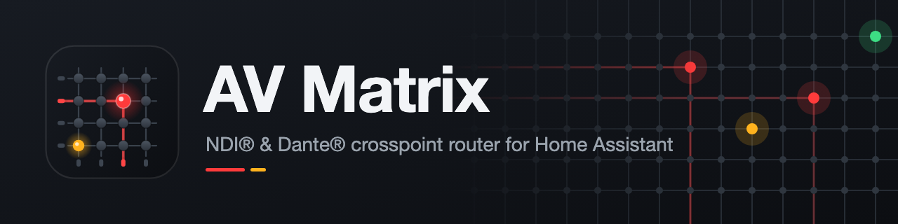
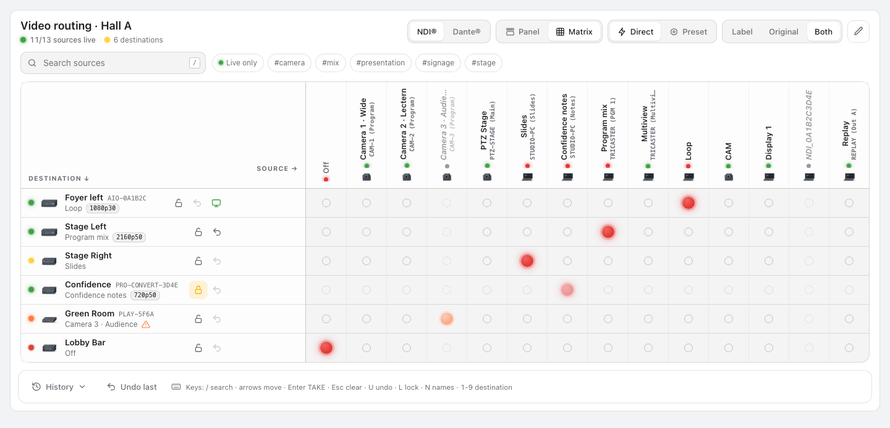
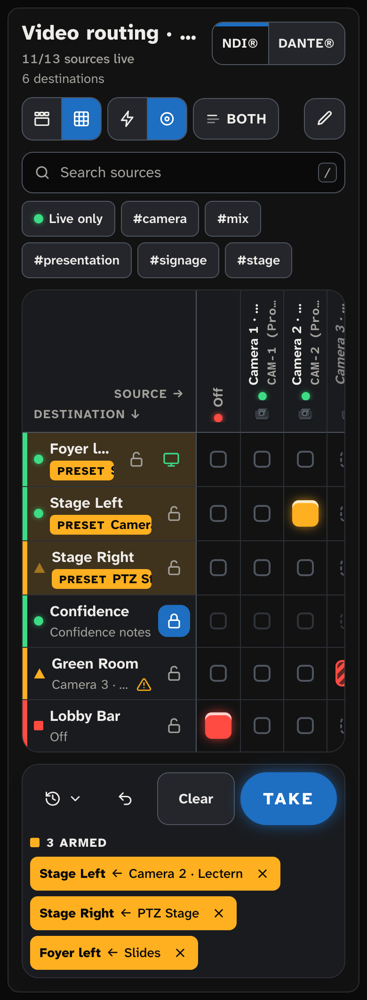
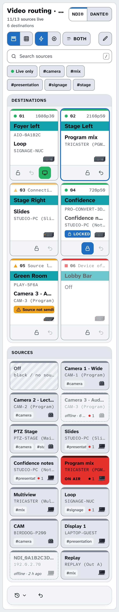
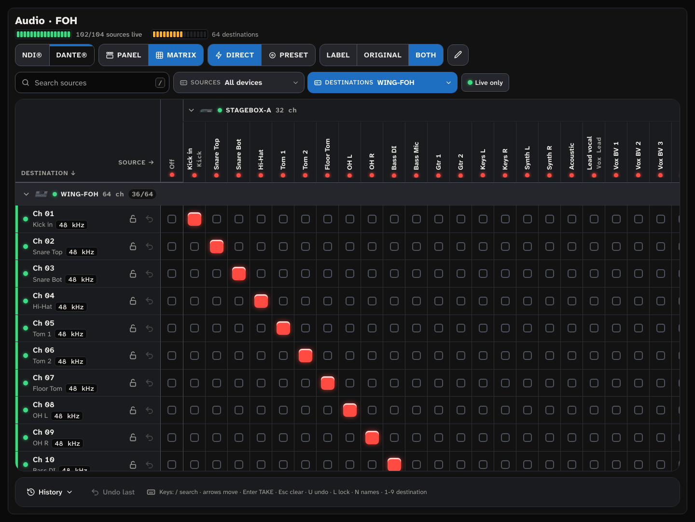
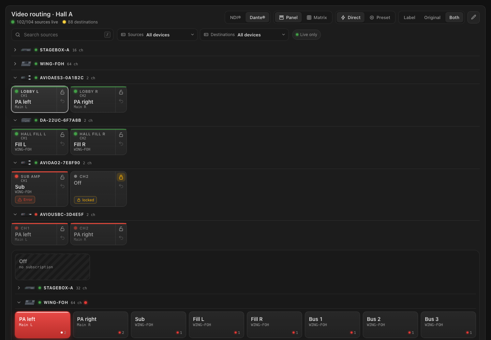
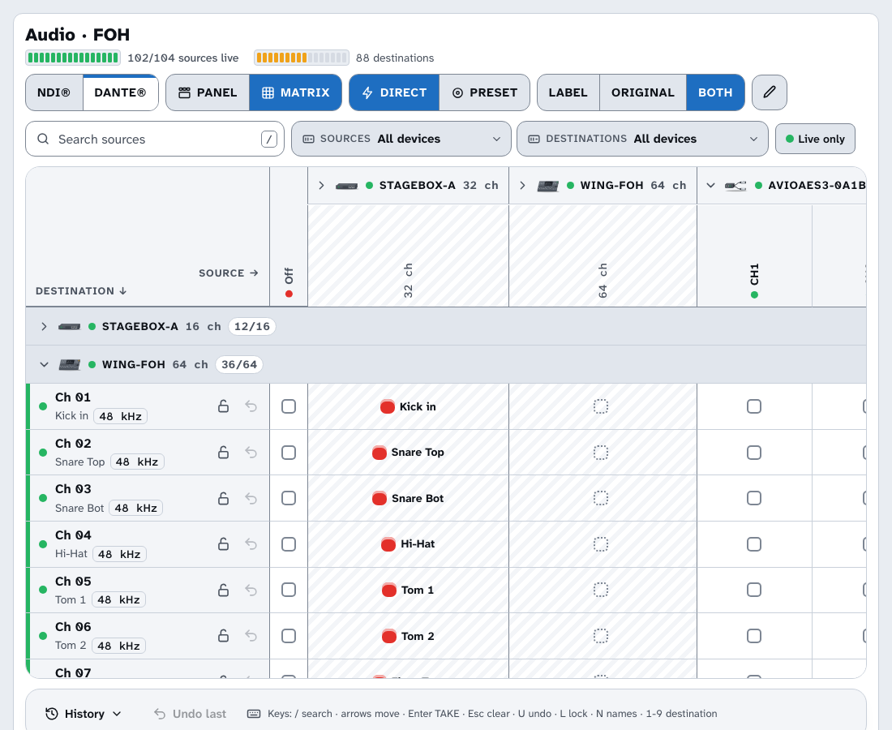
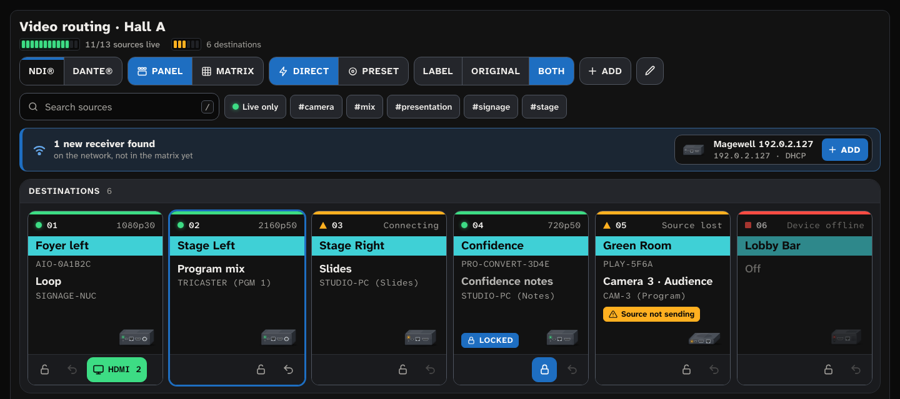
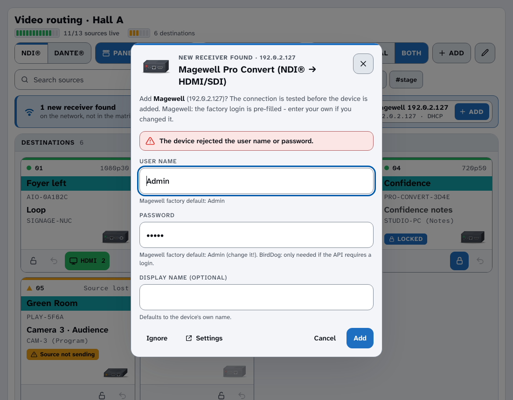

<p align="center"></p>

# AV Matrix for Home Assistant

**Smart crosspoint router for NDI® decoders (BirdDog, Magewell) and Dante® audio networks.**

[](https://hacs.xyz/docs/faq/custom_repositories)
[](https://github.com/strelle/ha-av-matrix/actions/workflows/validate.yml)


Turn the NDI® decoders behind your screens into a video router you control from Home Assistant: a source selector
per screen, automatic discovery of every NDI source on the network, a matrix card for the dashboard, automations,
HomeKit, and optional TV power/input control. The same matrix routes **Dante® audio**: every TX channel of every
Dante device on the network is a source, every RX channel a destination – found automatically, no login needed.

> Deutsch: [siehe unten](#deutsch).


<table><tr>
<td width="68%"><br>
</td>
<td width="32%"></td>
</tr><tr>
<td width="68%"></td>
<td width="32%"><br>
</td>
</tr></table>

*Screenshots from the [mock demo](docs/demo/index.html) (no Home Assistant needed: serve the repo with
`python3 -m http.server` and open `/docs/demo/`).*

## Features

- **Destinations** = your decoders (one config entry per device, as many as you like). Multi-channel devices get one
  destination per channel.
- **Sources** are discovered automatically and shared by all decoders:
  - mDNS (`_ndi._tcp.local.`) through Home Assistant's zeroconf,
  - the source lists of all configured decoders,
  - deduplicated by NDI name, stale entries filtered (TCP check), 2-minute hysteresis so lists don't jump,
  - BirdDog's `NDI_<id>` placeholders for names with umlauts are mapped to the real name.
- **Entities per destination:** `select` *Source* (the crosspoint), `sensor` *Connection*
  (connected / connecting / no source / source not sending / offline), `sensor` *Resolution* (e.g. `1920x1080p50`),
  `binary_sensor` *Connected*, `switch` *Route lock*; per device a *Refresh sources* `button`.
- **Actions:** `av_matrix.route`, `av_matrix.salvo` (several routes at once, validated first),
  `av_matrix.lock` / `unlock`, `av_matrix.undo`, `av_matrix.refresh_sources`; event `av_matrix_routed`.
- **Linked displays:** power on a TV/projector and switch its input when a destination is routed.
- **Labels:** give cryptic NDI names, decoder outputs and Dante channels a friendly label (sources also tags); the
  card switches between *Label*, *Original* and *both* like a broadcast router panel.
- **Device illustrations:** every decoder, Dante device and source is shown as a small drawing of the device
  (Magewell, BirdDog, AVIO adapters, Dante converters, WING …) whose LED shows the live status.
- **Router panel card** `custom:av-matrix-card`, shipped with the integration — no manual resource needed:
  X-Y panel and matrix view, direct or preset + TAKE (salvo), lock, undo, labels, history, keyboard control.
- **HomeKit-ready:** the source selects work with the HomeKit Bridge (one switch per source).
- Own integration icon and logo (shipped in `brand/`, shown by Home Assistant 2026.3+).
- Config flow with connection test, re-authentication, reconfigure, options, diagnostics (passwords redacted).
- **Dante® network** (*experimental*): one entry for the whole network, devices found via mDNS; TX channels =
  sources, RX channels = destinations, routing = subscriptions. See [Dante](#dante).
- Protocol-independent core: one tab per protocol in the card, sources only route within their protocol.

## Supported devices

| Device | Protocol | Status | Tested firmware | Notes |
|---|---|---|---|---|
| Magewell Pro Convert NDI to AIO | NDI® | ✅ verified (login, sources, routing, status) | 1.3.24 | other Pro Convert NDI decoders (to HDMI / SDI / 12G) use the same API — *untested* |
| BirdDog PLAY | NDI® | ⚠️ *untested with this integration* | (1.0.14 in an earlier project) | API on port 8080 |
| BirdDog Mini / Flex / Studio NDI / multi-channel | NDI® | ⚠️ *untested* | – | multi-channel via `ChNum` is *untested* |
| Dante® devices (ARC protocol) | Dante® | 🧪 *experimental*: discovery, names, channels, subscriptions read live; **switching untested on hardware** | ARC 2.8.9, router 4.3.0 (Audinate AVIO AES3, HDCVT ULTIMOX2) | one entry for the whole network, see [Dante](#dante) |

Details and API notes: [docs/devices.md](docs/devices.md). Want another device? Open a
[device request](https://github.com/strelle/ha-av-matrix/issues/new?template=device_request.yml) or
[write a driver](CONTRIBUTING.md).

## Installation

### HACS (recommended)

1. HACS → ⋮ → *Custom repositories* → add `https://github.com/strelle/ha-av-matrix`, type *Integration*.
2. Search for **AV Matrix**, download, restart Home Assistant.
3. *Settings → Devices & services → Add integration → AV Matrix.*

### Manual

Copy `custom_components/av_matrix` (or unzip `av_matrix.zip` from the
[latest release](https://github.com/strelle/ha-av-matrix/releases/latest)) into `<config>/custom_components/av_matrix`
and restart Home Assistant.

Requires Home Assistant **2026.8** or newer.

## Configuration

Add one entry per device — usually Home Assistant finds the decoders by itself (see [Discovery](#discovery)):

1. *Search the network for decoders*, or *Choose the device type manually*, e.g. *NDI® · Magewell Pro Convert*.
2. Enter host/IP, port (empty = default), credentials and an optional name. The connection is tested before the
   device is added.
   - **Magewell:** factory login is `Admin` / `Admin` — please change the password in the device's web UI.
   - **BirdDog:** the API on port 8080 normally needs no password; it is only used if the device asks for a login.
     Set *Number of decoder channels* for multi-channel devices.
3. Options (⚙ on the entry): polling interval (default 5 s) and a **linked display** per destination.

Sources need no configuration: everything that sends NDI on the network shows up within seconds.

## Discovery

New decoders show up **right in the matrix card** (admins): a banner *"1 new receiver found – Add"* opens the
confirmation in the card itself, and they are also listed under *Settings → Devices & services* as **Discovered**;
one click (Magewell: the factory login `Admin`/`Admin` is pre-filled, change it if yours differs) adds them. Devices that are already set up are
recognised (by serial number or MAC address), and a **new IP address is taken over** automatically.

| Way | Magewell Pro Convert | BirdDog | Dante® |
|---|---|---|---|
| **DHCP / device tracker** (MAC vendor prefix) | ✅ `D0:C8:57:8x` (verified, 3 devices) · `70:B3:D5:75:Dx` | `D4:20:00:Ax`, `70:B3:D5:3B:9x`, `70:B3:D5:C7:Ex` (*untested*) | – |
| **Known device, new IP** (DHCP `registered_devices`) | ✅ (MAC in device registry) | ✅ (serial, unit-tested only) | automatic (mDNS) |
| **mDNS / zeroconf** | ✗ only `_http._tcp` with the user-given name and no TXT data — nothing to match on | *untested* | ✅ `_netaudio-arc._udp` offers the *Dante network* entry (once) |
| **SSDP / UPnP** | ✗ does not answer M-SEARCH | *untested* | – |
| **Network scan** (config flow) | ✅ `GET /mwapi?method=get-summary-info` → `{"status":37}` | `GET :8080/about` (*untested on hardware*) | – |

**DHCP discovery needs Home Assistant to see the device's MAC address**: either HA receives the DHCP requests
(same network segment / HA OS with host networking), or a **device tracker** reports it — e.g. the **UniFi Network**
integration, Fritz!Box, nmap tracker. Home Assistant's DHCP integration also looks for hosts on its own network periodically. If the decoders sit in
another VLAN without a device tracker, use the scan.

**Network scan:** *Add integration → AV Matrix → Search the network for decoders*. The subnet defaults to Home
Assistant's own network (a /24; at most /22 is accepted). Every address is checked read-only and without login:
first a quick TCP connect to the driver's port (0.7 s timeout, 64 in parallel), then the driver's fingerprint
request. A /24 takes about 3 seconds. Every driver that implements `async_probe` takes part automatically.

## Dante



<table><tr>
<td width="57%"></td>
<td width="43%"></td>
</tr></table>

*Settings → Devices & services → Add integration → AV Matrix → **Dante® network*** (Home Assistant also offers it
as soon as a Dante device announces itself). That single entry covers the whole network:

- **Discovery:** every device that announces `_netaudio-arc._udp` via mDNS is added automatically and becomes a
  Home Assistant device (manufacturer/model from mDNS); new devices appear while running. If mDNS does not reach
  Home Assistant (other VLAN), add the device IPs as *additional device addresses*.
- **Sources** = TX channels, named like in Dante Controller: `channel@device`, e.g. `Kick@STAGEBOX-A` (the channel
  label if one is set). They disappear 2 minutes after their device went offline. Labels/tags work as for NDI.
- **Destinations** = RX channels. Routing sets the subscription of the RX channel, `None` removes it. The subscription
  is read back after writing; a refused or not applied subscription fails the route.
- **Entities per RX channel:** `select` *Source*, `sensor` *Subscription* (`subscribed`, `self`, `in_progress`,
  `unresolved`, `none`, `idle`, `warning`, `error`; attributes with Dante's status name and explanation, e.g.
  `UNRESOLVED – the transmitting device is not on the network`), `switch` *Route lock*.
  **Per device:** *TX channels*, *RX channels*, *Sample rate*, *Online*. **Network:** *Dante devices online*, *Refresh*.
- **Big devices:** devices with more than 32 RX channels (e.g. a 64×64 console card) get their entities **disabled by
  default** – enable the ones you need. The card routes all channels anyway (by destination id, see
  [frontend API](docs/frontend-api.md)). Options: hide devices completely, or create entities only for selected RX
  channels.
- **Card:** Dante is a second tab. Sources and destinations are grouped by device; each device can be collapsed
  (a collapsed source device becomes one summary column that lights up on the rows listening to it) and filtered
  (*Sources: device*, *Destinations: device*). Big devices start collapsed in panel mode.
- **Actions** work unchanged: `av_matrix.route` (`source: "Kick@STAGEBOX-A"`), `salvo`, `lock`, `undo` … plus an
  optional `destination` field with destination ids for RX channels without enabled entities.

**Limits** – this is an **unofficial implementation of a reverse-engineered protocol** (based on the public-domain
[netaudio](https://github.com/chris-ritsen/network-audio-controller) project), not affiliated with Audinate:

- Networks managed by **Dante Domain Manager** (authenticated control) are not supported.
- **AES67-only** devices (no Dante control protocol) and **multicast flows** (creating/choosing them) are not
  supported; subscriptions are made the normal way (the devices pick unicast/multicast themselves).
- No device settings (sample rate, latency, clocking, gain, channel names) – routing only.
- Switching has been verified against reference packets and a simulator, **not yet on real hardware** – test on
  channels that are not in use.

## Dashboard card

The card is loaded automatically. Add it via *Add card → AV Matrix* (visual editor) or YAML. In a sections
view give it the full width.

```yaml
type: custom:av-matrix-card
title: Video routing
mode: panel            # panel (X-Y) | matrix
take_mode: preset      # direct | preset (arm + TAKE)
name_mode: both        # label | original | both
# protocol: ndi        # start tab
# show_offline: true
# compact: false
# theme: auto          # auto (follows HA) | dark | daylight
# columns: 6           # source columns in the panel, 0 = auto
# destinations:        # selection and order, default: all
#   - select.stage_left_source
#   - select.stage_right_source
```

| Option | Default | Description |
|---|---|---|
| `title` | `AV Matrix` | Card title (empty = none). |
| `mode` | `panel` | `panel`: destinations on top, sources below (X-Y panel). `matrix`: destinations × sources grid. Narrow cards (< 640 px) start in panel mode. |
| `take_mode` | `direct` | `direct`: tapping a source switches immediately. `preset`: tapping arms the route (amber), **TAKE** switches all armed routes at once (salvo). |
| `name_mode` | `both` | Names shown: `label` (label, else the original name), `original` (device / NDI / Dante name), `both` (label, original name in small print underneath). Initial value only – the switch in the header is remembered per browser. |
| `protocol` | first | Protocol tab to start on (`ndi`, `dante`). Only sources of the same protocol can be routed. |
| `show_offline` | `true` | Show sources that stopped sending (greyed, "offline · 6 min"). |
| `compact` | `false` | Smaller tiles. |
| `theme` | `auto` | `dark` (control room, hall, evening), `daylight` (open air, stage, office: high-contrast light theme) or `auto` (follows the dark mode of the Home Assistant theme). |
| `columns` | auto | Number of source columns in panel mode. |
| `destinations` | all | List of destination `select` entities: which ones to show, in this order. |

Mode, take mode and names (**Label | Original | Both**, like on a Lawo panel) can also be switched in the card header
at any time.

**Design – Strelle Pult-UI.** The card follows the conventions of broadcast and live-sound consoles: one colour, one
meaning everywhere (red = program / on air, amber = preset / warning, green = ok, blue only for selection, focus and
TAKE), illuminated keys with a coloured state edge on top, destinations as scribble-strip displays with a coloured
name label, states always as text and shape too (LED forms, "ON AIR" / "PRESET" on the keys), touch targets of
56 px on touch screens, a dark and a high-contrast daylight theme. Type: Atkinson Hyperlegible Next for text and
Atkinson Hyperlegible Mono for values – shipped with the integration (SIL OFL 1.1, `frontend/fonts/`), no external
font service. Tally and preset colours can still be changed with the theme variables `av-matrix-tally-color` and
`av-matrix-preset-color`.

**Operating it like a router panel**

- **Panel:** pick a destination (its current source lights up red = program/tally), then pick a source.
  Several destinations: **Shift/Ctrl-click** or **long-press** (touch) – the source then goes to all of them
  (salvo). Number badges show the selection order.
- **Matrix:** click a crosspoint. Lit red = on air, lit amber = armed, red striped = routed source not sending.
  Hover shows a crosshair; headers stay in place while scrolling large matrices.
- **Preset + TAKE:** armed routes are listed in the take bar; **TAKE** switches them together (validated first –
  a locked destination fails the whole salvo), **Clear**/Esc discards them. If switching fails the presets come back
  and an error is shown.
- **Status:** LED (form *and* colour) and coloured top edge per destination – green circle connected, amber
  triangle connecting / source not sending, ring no source, red square device offline; resolution (e.g. `1080p50`).
- **Lock** (padlock) protects a destination, **undo** (↶) restores its previous source; *Undo last* in the footer
  undoes the latest route made from the card. The **TV** button switches a linked display on/off and shows its input.
- **Search and tags** filter the sources; *Live only* hides offline sources.
- **Add receivers (admins):** when Home Assistant has discovered a decoder (DHCP / mDNS) that is not set up yet, a
  banner *"1 new receiver found"* appears under the header. **Add** opens the setup right in the card: credentials
  (Magewell factory login pre-filled), optional name, done – the new destination appears immediately. A wrong
  password is shown as an error in the form; *Ignore* hides the device like in the settings, *Settings* opens
  *Devices & services*. The **+ Add** button in the header runs the same dialog for any device: *Search the network*
  (scan, pick from the results) or *Choose the device type manually*. Non-admin users see neither.

  
  
- **Labels (admins):** pencil button in the header, then tap a source or a destination – or right-click / long-press
  a source, double-click / long-press a destination name (right-click works too). Give cryptic NDI names and
  device names a friendly label (sources also tags); the original name stays visible in small print in *Both* mode.
  Destination labels only rename the destination in the card, not the entities in Home Assistant.
- **Names:** *Label | Original | Both* in the header (key `N`) switches every name in the card – tiles, matrix
  headers, take bar, history, messages. Search always finds label, original name and tags.
- **Devices:** each destination shows a small drawing of its device (Magewell, BirdDog, AVIO adapters, WING, …) whose
  LED follows the status; sources show a small icon (Dante: on the device header).
- **History:** the last 50 routes with time, destination, source, previous source, origin and user (who switched;
  user names are resolved for admins).
- Switching shows *switching…* immediately and is confirmed by the live state from Home Assistant.

**Keyboard** (when the card has focus):

| Key | Action |
|---|---|
| `/` | Search sources (Esc clears, ↓ jumps into the sources) |
| Arrow keys | Move between destinations, sources and crosspoints |
| Enter / Space | Press the focused tile; **Enter** elsewhere (or Ctrl/⌘+Enter anywhere) = **TAKE** |
| Esc | Clear presets / multi-selection |
| `U` | Undo (focused or selected destination, else the last route) |
| `L` | Lock / unlock the focused or selected destination |
| `N` | Names: Label → Original → Both |
| `1` – `9` | Select destination 1–9 (Shift adds to the selection) |

The card follows your Home Assistant theme (dark and light) and respects *reduced motion*. Tally colours can be
themed with `--av-matrix-tally-color` and `--av-matrix-preset-color`. Without the WebSocket API (older version)
it falls back to the `select` entities (*basic mode*). The plain `select` entities work in any entities card too.

## Automations

Route on a button press, and the screens of a room at once:

```yaml
automation:
  - alias: "Show slides in the lobby"
    triggers:
      - trigger: state
        entity_id: input_button.lobby_slides
    actions:
      - action: av_matrix.route
        target:
          entity_id: select.lobby_source
        data:
          source: "STUDIO-PC (Slides)"

  - alias: "Conference start"
    triggers:
      - trigger: time
        at: "08:45:00"
    actions:
      - action: av_matrix.salvo
        data:
          routes:
            - destination: select.lobby_source
              source: "STUDIO-PC (Welcome)"
            - destination: select.stage_left_source
              source: "CAMERA-1 (Program)"
            - destination: select.stage_right_source
              source: "None"   # off

  - alias: "Notify when a screen loses its source"
    triggers:
      - trigger: state
        entity_id: sensor.lobby_connection
        to: source_lost
        for: "00:00:30"
    actions:
      - action: notify.notify
        data:
          message: "Lobby screen: source stopped sending"
```

React to routing with the event `av_matrix_routed` (`entity_id`, `source`, `previous_source`, `origin`).
Lock a screen during a show with `av_matrix.lock` or its *Route lock* switch.

## Linked displays

*E.g. LG webOS TVs via the webOS integration — works with any `media_player`.*

In the options of a device, pick a `media_player` per destination, its input (e.g. `HDMI 2`, suggestions come from
the TV's source list) and whether to

- **power on & switch input on route** (default on), and
- **turn the display off when routed to None**.

When the destination is routed, AV Matrix turns the display on if needed, waits until it is on (max 10 s, without
blocking other destinations) and selects the input if it is not already active. Display problems never fail the
route; they are logged and shown as `display_error`.

## HomeKit

Expose the `select.*_source` entities with the **HomeKit Bridge** integration. HomeKit Bridge shows a `select`
as a group of switches, one per option — tap a switch to route that source. Tips:

- HomeKit builds the accessory when the bridge starts; sources that appear later need a reload of the HomeKit
  Bridge entry. For a stable HomeKit view, create a template `select` with your favourite sources and route via
  `av_matrix.route`.
- Give long NDI names a label so the switches stay readable.

## Updates

Every change to the integration is published as a GitHub release, so HACS shows it as an **update entity**
(`update.av_matrix_update`) with release notes. Integration updates need a **Home Assistant restart** to become active.

Optional auto-update, only when you allow it (an `input_boolean.av_matrix_auto_update`), with a nightly restart:

```yaml
automation:
  - alias: "AV Matrix auto-update"
    triggers:
      - trigger: state
        entity_id: update.av_matrix_update
        to: "on"
    conditions:
      - condition: state
        entity_id: input_boolean.av_matrix_auto_update
        state: "on"
    actions:
      - action: update.install
        target:
          entity_id: update.av_matrix_update
      - action: input_boolean.turn_on
        target:
          entity_id: input_boolean.restart_pending   # helper you create

  - alias: "Nightly restart after updates"
    triggers:
      - trigger: time
        at: "04:00:00"
    conditions:
      - condition: state
        entity_id: input_boolean.restart_pending
        state: "on"
    actions:
      - action: input_boolean.turn_off
        target:
          entity_id: input_boolean.restart_pending
      - action: homeassistant.restart
```

## Troubleshooting

- **No sources appear.** mDNS must reach Home Assistant: run HA with host networking (default for HA OS /
  `network_mode: host` in Docker) and allow multicast between the VLANs. If your network uses an
  **NDI Discovery Server** instead of mDNS, AV Matrix only sees what the decoders list.
- **A source shows as not live but is sending.** BirdDog source lists are verified by a TCP connection to the
  sender; a firewall on the sender can block that. Magewell lists and mDNS are trusted as-is.
- **Sources linger.** They disappear 2 minutes after they stopped sending (on purpose). *Refresh sources* drops
  cached knowledge immediately.
- **Magewell: "invalid authentication".** Wrong password — Home Assistant starts a re-authentication flow.
- **BirdDog shows its logo.** The routed source is not sending; the connection sensor says *Source not sending*.
- **Diagnostics:** device page → ⋮ → *Download diagnostics* (passwords are redacted). Debug log:

  ```yaml
  logger:
    logs:
      custom_components.av_matrix: debug
  ```

## Roadmap

- Dante®: verify switching on more hardware, optional channel-label display from `_netaudio-chan`, stable device
  identity across renames.
- More NDI® decoders: Kiloview, NewTek/Vizrt Connect Spark, Teradek, …
- **HDMI-CEC via decoder APIs** (if supported by the device) as an alternative to linked displays.
- NDI port-5960 queries as an extra source of truth, Discovery Server support.

## Development

See [CONTRIBUTING.md](CONTRIBUTING.md). Tests: `pytest` (drivers against recorded answers, source registry,
linked displays, config flow, services, WebSocket API).

---

## Deutsch

**AV Matrix** macht aus NDI®-Decodern (BirdDog, Magewell) eine Kreuzschiene in Home Assistant.

- **Ziele** sind die Decoder hinter den Bildschirmen; jedes Gerät wird über *Einstellungen → Geräte & Dienste →
  Integration hinzufügen → AV Matrix* angelegt (erst Protokoll/Hersteller wählen, dann Adresse und Zugangsdaten;
  die Verbindung wird dabei geprüft). Magewell-Werkszugang `Admin`/`Admin` – bitte ändern.
- **Automatische Erkennung:** neue Decoder meldet die Karte selbst (Admins): Banner „1 neuer Empfänger gefunden –
  Hinzufügen“, die Einrichtung läuft direkt in der Karte (Zugangsdaten, fertig; falsches Passwort = Fehler im
  Formular). Der Knopf **+ Hinzufügen** in der Kopfzeile startet dasselbe für beliebige Geräte (Netzwerk durchsuchen
  oder Gerätetyp wählen). Außerdem erscheinen sie unter *Geräte & Dienste* als „Entdeckt“ und werden mit einem
  Klick übernommen (Magewell: Werkszugang vorausgefüllt). Erkannt werden sie über die MAC-Herstellerkennung (DHCP –
  dafür muss HA die DHCP-Anfragen sehen oder ein Device-Tracker wie UniFi die MAC melden); bekannte Geräte mit neuer
  IP werden automatisch nachgeführt. Zusätzlich: *Integration hinzufügen → AV Matrix → Netzwerk nach Decodern
  durchsuchen* fragt das eigene /24 (oder ein angegebenes Subnetz bis /22) nur lesend ab (~3 s). Magewell sendet
  kein verwertbares mDNS und kein SSDP; Dante-Geräte schlagen per mDNS den Eintrag „Dante®-Netzwerk“ vor.
- **Quellen** werden automatisch gefunden (mDNS und die Listen aller Decoder), nach NDI-Namen zusammengeführt;
  veraltete Einträge fallen weg, verschwundene Quellen bleiben 2 Minuten stehen, damit nichts springt.
  Umlaut-Namen, die BirdDog nur als `NDI_…` kennt, werden über die Adresse zugeordnet.
- **Pro Ziel:** Auswahl *Quelle* (`select`), *Verbindung*, *Auflösung*, *Verbunden*, *Schaltsperre*;
  pro Gerät *Quellen aktualisieren*.
- **Aktionen:** `av_matrix.route`, `av_matrix.salvo` (mehrere Ziele, vorher komplett geprüft), `lock`/`unlock`,
  `undo`, `refresh_sources`; Ereignis `av_matrix_routed`.
- **Bildschirme koppeln:** In den Optionen pro Ziel einen `media_player` (z. B. LG-TV über webOS) und den Eingang
  wählen – beim Schalten wird der TV eingeschaltet und der Eingang gewählt, bei „None“ optional ausgeschaltet.
- **Karte:** `type: custom:av-matrix-card` – wird von der Integration selbst ausgeliefert, keine Ressource nötig.
  Kreuzschienen-Bedienfeld wie bei Videohub & Co.: Panel (Ziel wählen → Quelle) oder Matrix, Direkt oder
  Preset + TAKE (Salvo, Mehrfachauswahl per Shift/Long-Press), Sperre, Undo, Labels/Tags (Admin), Verlauf mit
  Benutzer, Tastatur (`/` Suche, Enter TAKE, Esc verwerfen, U Undo, L Sperre, N Namen). Namensanzeige wie bei Lawo
  umschaltbar: *Label | Original | Beide* (`name_mode`, im Browser gemerkt); Labels (Admin) auch für Ziele
  (Stift, dann Ziel antippen, oder Doppelklick / langes Drücken auf den Zielnamen). Jedes Gerät wird als kleine
  Zeichnung mit Status-LED gezeigt. Optionen siehe Tabelle oben.
- **HomeKit:** die Quellen-Auswahl über die HomeKit-Bridge freigeben (ein Schalter pro Quelle; neue Quellen erst nach Neuladen der Bridge).
- **Updates** kommen über HACS (Update-Entität), danach Home Assistant neu starten.
- **Dante®** (*experimentell*): Eintrag „Dante®-Netzwerk“ übernimmt alle Dante-Geräte im Netz automatisch (mDNS,
  ohne Zugangsdaten). TX-Kanäle sind Quellen (`Kanal@Gerät`), RX-Kanäle Ziele; Schalten setzt bzw. löscht die
  Subscription. Pro RX-Kanal: Quelle (`select`), Subscription-Sensor, Schaltsperre; pro Gerät Kanalzahlen,
  Abtastrate, Online. Geräte mit mehr als 32 RX-Kanälen: Entitäten standardmäßig deaktiviert, die Karte schaltet
  trotzdem alle. Karte: eigener Tab, nach Gerät gruppiert, einklappbar, Gerätefilter. Nicht unterstützt: Dante
  Domain Manager, reine AES67-Geräte, Multicast-Flows. Inoffizielles, nachgebautes Protokoll – das Schalten ist
  noch nicht auf echter Hardware getestet.
- **Keine Quellen sichtbar?** mDNS muss HA erreichen (Host-Netzwerk, Multicast zwischen VLANs). Mit NDI Discovery
  Server sieht AV Matrix nur, was die Decoder melden.

Installation über HACS (benutzerdefiniertes Repository `https://github.com/strelle/ha-av-matrix`, Typ Integration)
oder manuell nach `<config>/custom_components/av_matrix`, danach Neustart.

---

NDI® is a registered trademark of Vizrt NDI AB. Dante® is a registered trademark of Audinate Group Pty Ltd; the Dante
support uses an unofficial, reverse-engineered protocol. This project is not affiliated with, endorsed or sponsored
by Vizrt, Audinate, BirdDog, Magewell, Behringer, Neutrik or HDCVT. The device illustrations are our own stylised
drawings, not manufacturer artwork; product names only identify the supported devices. Protocol knowledge from
netaudio (public domain), see [NOTICE](NOTICE).

License: [MIT](LICENSE) · © 2026 Strelle
